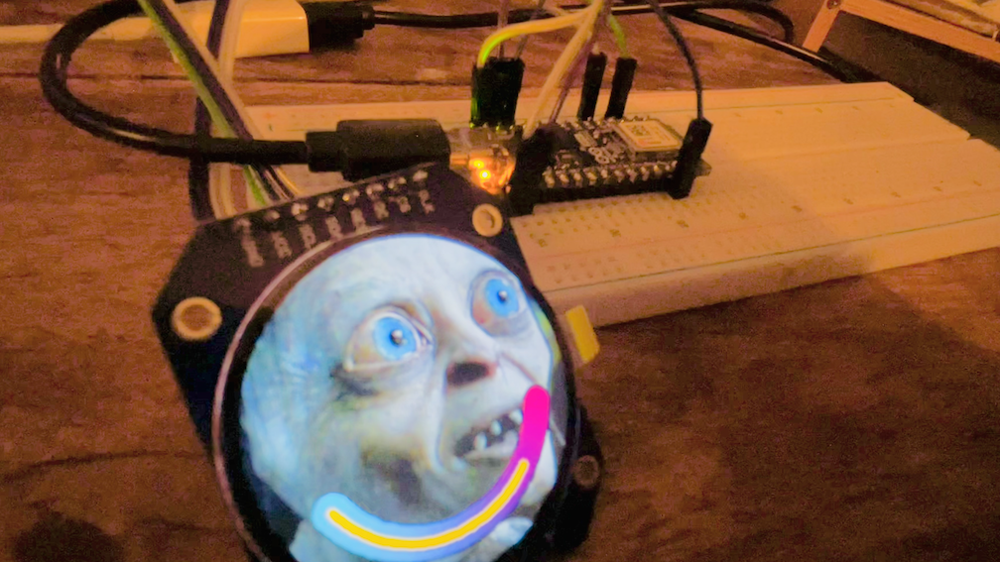
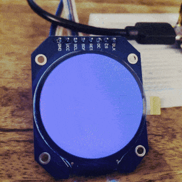
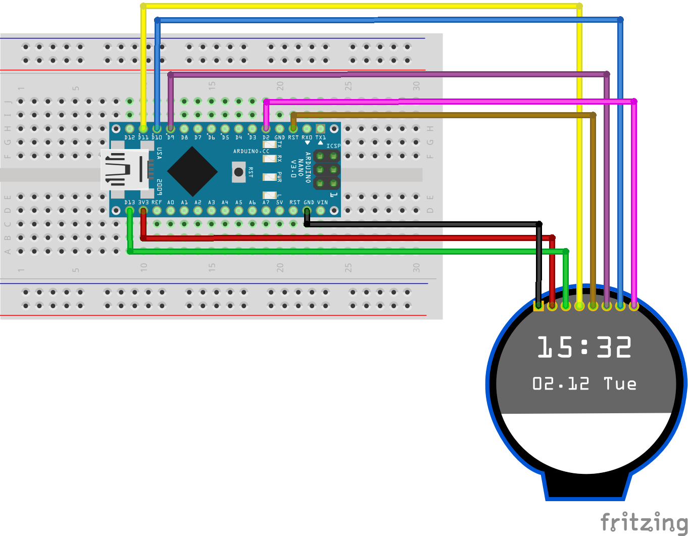

 

# TFT tester

 

Sketch for testing the [LCD TFT circular display](https://letmeknow.fr/fr/ecrans/2790-module-d-affichage-lcd-tft-circulaire-652733464798.html) with an [Arduino Nano ESP32](https://store.arduino.cc/products/nano-esp32) microcontroller.

| Color | TFT | Nano |
| ----- | --- | ---- |
| Red  | `VCC` | `3.3V` |
| Black  | `GND` | `GND` |
| Green | `SCL` | `D13` |
| Yellow | `SDA` | `D11` |
| Ochre | `RES` | `RESET` |
| Purple | `DC` | `D9` |
| Blue | `CS` | `D10` |
| Pink | `BLK` | `D2` |

## Tutorials

-  The [DroneBot Workshop](https://dronebotworkshop.com/gc9a01/)

## Images Image converter

- This [Image converter](http://www.rinkydinkelectronics.com/t_imageconverter565.php) tool can convert images to C array

## Colors

- Test of dynamic gradient of colors

## UI

- Test of circular progress bar based on
  - [Adafruit_GFX](https://github.com/adafruit/Adafruit-GFX-Library) ([documentation](https://cdn-learn.adafruit.com/downloads/pdf/adafruit-gfx-graphics-library.pdf))
  -  [Adafruit_GC9A01A](https://github.com/adafruit/Adafruit_GC9A01A)

## Resources

- [First attempt at creating part for Waveshare 1.28 inch round LCD module](https://forum.fritzing.org/t/first-attempt-at-creating-part-for-waveshare-1-28-inch-round-lcd-module/16688/2)
- [Breadboard game using Arduino NANO ESP32 and GC9A01 display](https://www.youtube.com/watch?v=GjI8mUnlrPM)

